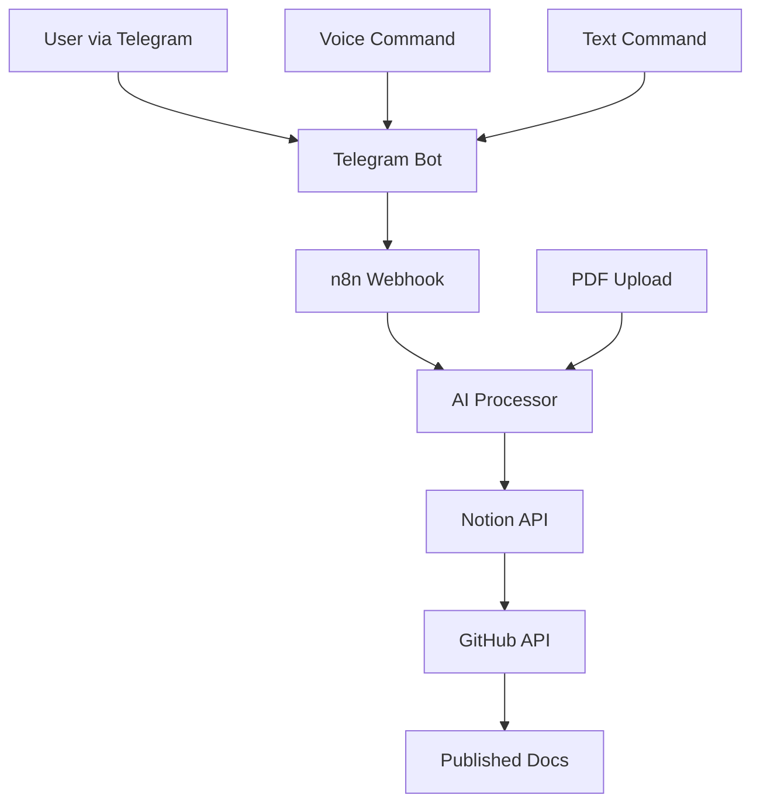

# Architecture Overview

## System Architecture

The Automation Documentation Agent follows a microservices architecture with the following key components:

### Core Components

#### 1. Telegram Bot Interface
- **Purpose**: Primary user interaction layer
- **Technology**: Node.js with Telegraf framework
- **Features**:
  - Command handling (`/brainstorm`, `/generate`, `/query`)
  - File upload processing (PDF, DOCX, MD)
  - Voice command support
  - Real-time status updates

#### 2. n8n Automation Engine
- **Purpose**: Workflow orchestration and automation
- **Technology**: n8n platform
- **Features**:
  - Document processing workflows
  - API integrations
  - Error handling and retry logic
  - Webhook management

#### 3. AI Processing Engine
- **Purpose**: Document analysis and generation
- **Technology**: Python with OpenAI API
- **Features**:
  - PDF text extraction
  - Document summarization
  - Content generation
  - Context analysis

#### 4. Notion Integration
- **Purpose**: Document storage and collaboration
- **Technology**: Notion API
- **Features**:
  - Document database management
  - Template application
  - Version tracking
  - Collaborative editing

#### 5. GitHub Integration
- **Purpose**: Version control and publishing
- **Technology**: GitHub API
- **Features**:
  - Repository management
  - Commit automation
  - Pull request creation
  - Documentation publishing

## Data Flow

## Component Interactions

### 1. User Interaction Flow
1. User sends command or uploads file via Telegram
2. Telegram bot validates input and forwards to n8n
3. n8n triggers appropriate workflow
4. AI processor analyzes content
5. Results stored in Notion
6. Changes committed to GitHub

### 2. Document Processing Pipeline
1. **Input Validation**: Check file format and size
2. **Content Extraction**: Extract text from PDFs/DOCX
3. **AI Analysis**: Process content with AI models
4. **Template Application**: Apply document templates
5. **Quality Review**: Automated content review
6. **Publishing**: Commit to GitHub repository

## Security Considerations

- **API Key Management**: Secure storage of all API keys
- **File Validation**: Strict file type and size validation
- **Rate Limiting**: Implement rate limiting for all APIs
- **Error Handling**: Comprehensive error logging and handling
- **Data Privacy**: Ensure user data privacy and compliance

## Scalability Design

- **Horizontal Scaling**: Microservices can scale independently
- **Load Balancing**: Distribute traffic across multiple instances
- **Caching**: Implement caching for frequently accessed data
- **Queue Management**: Use message queues for async processing
- **Database Optimization**: Optimize database queries and indexing

## Monitoring and Logging

- **Application Monitoring**: Track system performance and health
- **Error Tracking**: Comprehensive error logging and alerting
- **Usage Analytics**: Monitor user interactions and system usage
- **Performance Metrics**: Track response times and throughput
- **Audit Logging**: Log all system actions for compliance
